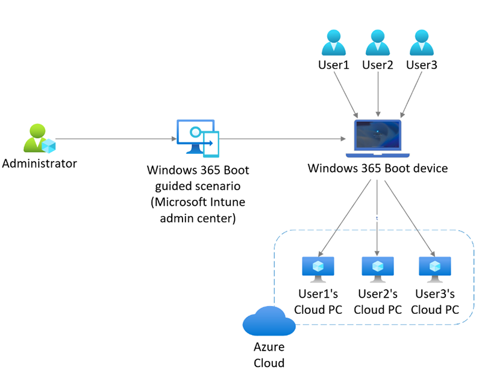

---
# required metadata
title: What is Windows 365 Boot?
titleSuffix:
description: What is Windows 365 Boot?
keywords:
author: ErikjeMS  
ms.author: erikje
manager: dougeby
ms.date: 05/24/2023
ms.topic: overview
ms.service: windows-365
ms.subservice:
ms.localizationpriority: high
ms.technology:
ms.assetid: 

# optional metadata

#ROBOTS:
#audience:

ms.reviewer: elluthra
ms.suite: ems
search.appverid: MET150
#ms.tgt_pltfrm:
ms.custom: intune-azure; get-started; intro-overview
ms.collection:
- M365-identity-device-management
- tier2
---

# What is Windows 365 Boot?

Windows 365 Boot is in [public preview](..\public-preview.md). During this preview, Windows 365 Boot is designed for shared PC scenarios.

Windows 365 Boot lets admins configure Windows 11 physical devices so that users can:

- Avoid signing in to their physical device.
- Sign in directly to their Windows 365 Cloud PC on their physical device.

When a user turns on their physical device and signs in, Windows 365 Boot signs them in directly to their Cloud PC, not their physical device. If single sign-on is turned on for their Cloud PC, they don't have to sign in again to their Cloud PC. This expedited sign in process reduces the time it takes the user to access their Cloud PC.

Multiple users can use the same physical device to sign in to their own personal Cloud PCs. When each user signs in to the physical device, their unique identity takes them to their assigned and secure Cloud PC. This flexibility makes Windows 365 Boot a good solution for workers such as nursing, salespeople, and call centers, who share company physical devices. Such workers might frequently switch between physical tasks and computer interaction. Windows 365 Boot lets them bypass the lengthy startup process and boot directly into their secure Cloud PC to pick up right where they left off.

Such workers can:

1. Sign out from their Cloud PC on the physical device.
2. Pass the physical device over to the next employee during a shift change.
3. The next shift worker can use the same physical device to sign in to their Cloud PC.

Signing out of the Windows 365 Cloud PC brings the device back to the Windows 11 login screen, ready for the next user.

## Access to the physical device

Windows 365 Boot physical devices are intended to let users interact with their Cloud PCs without the ability to interact with the physical device. To meet this goal, you must set some configuration service provider (CSP) policies.

During the preview, Windows 365 Boot doesn't automatically set these policies to fully restrict end users from accessing certain resources on the physical device. You should review the  configuration policies that can be applied to your Windows 365 Boot devices to meet your organization’s security needs for preventing access to the physical device. For more information about these configuration profiles, see [Restrict user access to Windows 365 Boot physical device](windows-365-boot-restrict-user-access-physical-device.md).

## Process overview

1. Using the [Windows 365 Boot guided scenario](windows-365-boot-guide.md) in the Microsoft Intune admin center, configure the physical device for Windows 365 Boot.
2. (Optional) [Consider restricting user access to Windows 365 Boot physical devices](windows-365-boot-restrict-user-access-physical-device.md).
3. Set up each physical device for Windows 365 Boot configuration.
4. After the device is configured, multiple users can access their dedicated Cloud PCs from the same Windows 365 Boot physical device.  

## User sign-in authentication modes

Windows 365 Boot supports username/password-based authentication for user sign in to their Cloud PC. Windows Hello for Business, convenience PIN, and FIDO key authentication modes aren't supported.

<!-- ########################## -->
## Next steps

[Windows 365 Boot guided scenario](windows-365-boot-guide.md).

[Windows 365 Boot physical device requirements](windows-365-boot-physical-device-requirements.md).

[Restrict user access to Windows 365 Boot physical device](windows-365-boot-restrict-user-access-physical-device.md).

[Troubleshoot Windows 365 Boot](troubleshoot-windows-365-boot.md).

[Visit the Microsoft tech community blog](https://aka.ms/W365BootPublicPreview).
