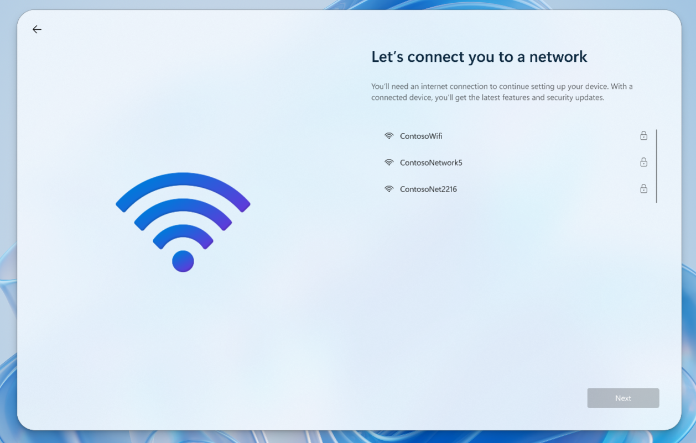
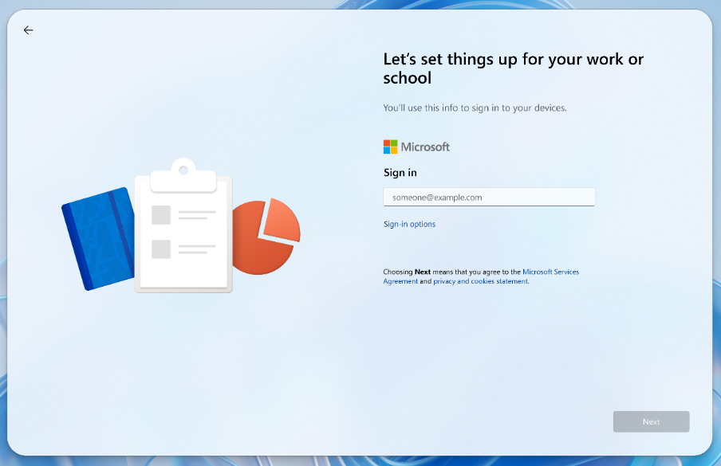

---
# required metadata
title: Set up Windows 365 Link
titleSuffix:
description: Learn how to set up your Windows 365 Link
keywords:
author: ErikjeMS  
ms.author: erikje
manager: dougeby
ms.date: 11/19/2024
ms.topic: overview
ms.service: windows-365
ms.subservice:
ms.localizationpriority: high
ms.assetid: 

# optional metadata

#ROBOTS:
#audience:

ms.reviewer: sajelaci
ms.suite: ems
search.appverid: MET150
#ms.tgt_pltfrm:
ms.custom: intune-azure; get-started; intro-hub-or-landing
ms.collection:
- M365-identity-device-management
- tier2
---

# Set up your Windows 365 Link and sign in

The first time you turn on your Windows 365 Link, you're guided through setting up your device and signing in with a work or school user account.

## Requirements

- An available network.
- A work or school account.
- A Windows 365 Cloud PC.

## First time set up

Complete the following steps to set up your new device:

1. Connect a monitor, USB keyboard, and USB mouse (recommended) to the device.
2. Connect the power adaptor to the power port and then into a power outlet.
3. Power on the device.
4. On the **Let's connect you to a network** page, select a network > **Next**.

5. On the **Let's set things up for your work or school** page, type your work or school e-mail > **Next**

7. Authenticate your account as requested. Your organization defined the authentication method (FIDO2 security key, Passkey (FIDO2), Microsoft Authenticator app, and so on).
8. You're connected to your Cloud PC with all of your context and apps just where you left off.

You can adjust additional settings prior to sign-in by using [Quick settings](quick-settings.md) in the bottom-right corner.

When you sign in for the first time, the Windows 365 Link automatically joins Microsoft Entra ID and enrolls the device into Microsoft Intune tenant associated with the account used to sign in. Your organization's admins use Intune to manage both virtual machines and hardware devices, including Windows 365 Link.

<!-- ########################## -->
## Next steps

[Use Quick Settings to view and manage monitors, languages, network connections, and more](quick-settings.md).

[Use the Control-Alt-Delete menu to mange manage tasks, connections, sign-out, or lock your Windows 365 Link.](control-alt-delete.md)
