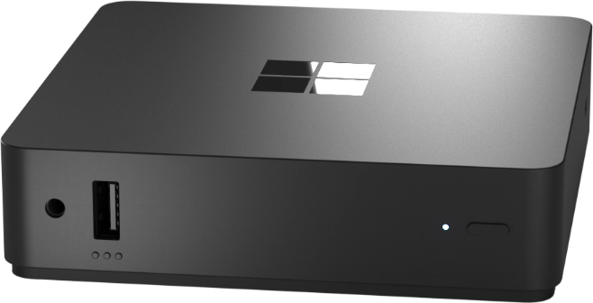
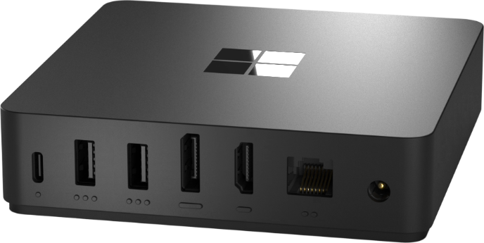
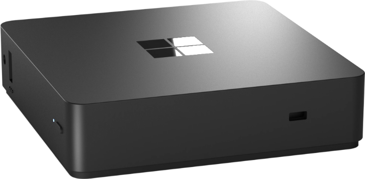

---
# required metadata
title: Unboxing your Windows 365 Link
titleSuffix:
description: Learn about unboxing your Windows 365 Link.
keywords:
author: ErikjeMS  
ms.author: erikje
manager: dougeby
ms.date: 11/19/2024
ms.topic: overview
ms.service: windows-365-link
ms.subservice:
ms.localizationpriority: high
ms.assetid: 

# optional metadata

#ROBOTS:
#audience:

ms.reviewer: sajelaci
ms.suite: ems
search.appverid: MET150
#ms.tgt_pltfrm:
ms.custom: intune-azure; get-started;
ms.collection:
- M365-identity-device-management
- tier2
---

# What's in the box

When you unbox your Windows 365 Link, you'll find the following hardware, software, and network and peripheral support.

## Hardware

Your box includes:

- Windows 365 Link device.
- Power adaptor.
- Quick start guide.

### Ports

The Windows 365 Link has the following ports:

#### Front panel

- USB-A
- 3.5 mm audio jack
- Power button and LED indicator

#### Back panel

- USB-C
- Two USB-A
- DisplayPort
- HDMI
- Ethernet
- Power supply

#### Side panel

Kensington lock to physically secure the device

### Power

**Power supply**: Barrel type, 65 watts.

**Fan**: None.

## Monitor support

Both the HDMI and Display Port support one monitor each, up to 4k in resolution.

## Peripheral support

USB and Bluetooth support for:

- Keyboard
- Mouse
- Headphones
- Camera

## Software

The Windows 365 Link comes pre-installed with the Windows CPC operating system.

Operating system updates occur automatically during off hours. To get these updates, make sure the device is plugged in and powered on (in standby or sleep mode).

## Wireless support

- Wi-Fi 6E
- Bluetooth 5.3

## Compute and connectivity

| Component | Details |
| --- | --- |
| Memory | 8 GB LPDDRS |
| Storage | 64 GB UFS |
| Wi-Fi | WiFi 6E |
| Bluetooth | 5.3 |
| USB | USB-C, 2 USB-A |

<!-- ########################## -->
## Next steps

[First time set up for your Windows 365 Link](setup.md): After unboxing, your Windows 365 Link is brand-new and no users are logged into the device. The device must go through first-time setup, also known as the Out-of-Box Experience (OOBE). Through this setup process, the device is automatically joined to Microsoft Entra and enrolled in Microsoft Intune.
