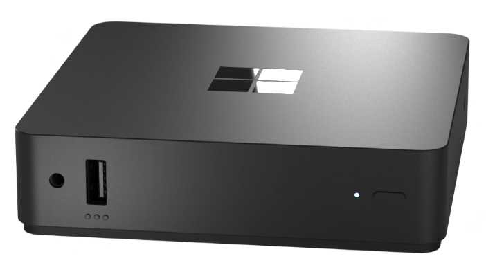

---
# required metadata
title: What is NXT?
titleSuffix:
description: What is NXT?
keywords:
author: ErikjeMS  
ms.author: erikje
manager: dougeby
ms.date: 11/19/2024
ms.topic: overview
ms.service: windows-365
ms.subservice:
ms.localizationpriority: high
ms.assetid: 

# optional metadata

#ROBOTS:
#audience:

ms.reviewer: sajelaci
ms.suite: ems
search.appverid: MET150
#ms.tgt_pltfrm:
ms.custom: intune-azure; get-started; intro-hub-or-landing
ms.collection:
- M365-identity-device-management
- tier2
---

# What is NXT?

[!INCLUDE [MS confidential, draft docs](../includes/draft-doc.md)]

> [!NOTE]
> NXT is in ["public preview"](../public-preview.md). Administrators who want to participate in the preview and get NXT devices for their organization should contact their Microsoft account team. As part of your participation, you can join the Customer Connections Program and Office hours for the latest updates.

NXT is the first Cloud PC hardware device that lets users connect directly to their Cloud PC virtual machine. It’s a full stack, purpose-built solution by Microsoft. When users sign in to their NXT, they're securely connected to their Windows 365 [Cloud PC virtual machine](/windows-365/overview#what-is-a-cloud-pc) through the Windows 365 service.

Admins use Microsoft Intune to manage NXTs alongside other devices.

## Secure by design

NXT is secure by design, thanks to the following features:

- Trusted Platform Model.
- Secure boot.
- BitLocker drive encryption.
- Hypervisor Code Integrity.
- Microsoft Defender EDR Sensor.
- No local administrator.
- No local data storage.
- No local apps.
- Arbitrary software can't be installed or executed on the NXT, so it's protected from malware.
- Security baseline policies are enabled by default.
- Security features can't be disabled.
- Windows Defender Firewall
- Windows Defender Application Guard

## Requirements

Requirements for NXT include:

- NXT device.
- Management by your organization using Microsoft Intune.
- [Windows 365 license](https://www.microsoft.com/licensing/product-licensing/windows-365?rtc=1) for your Cloud PC.

## Device capabilities

### Media optimizations

NXT supports local redirection of web multimedia content, ensuring a smooth, high-quality experience, just like on a local PC.

## ??Device certifications??

- [Product safety](https://support.microsoft.com/en-us/windows/product-safety-warnings-and-instructions-726eab87-f471-4ad8-48e5-9c25f68927ba)
- [Product safety warnings and instructions](https://support.microsoft.com/en-us/windows/product-safety-warnings-and-instructions-726eab87-f471-4ad8-48e5-9c25f68927ba)

## Unit dimensions

| Dimension | Units metric | Units imperial |
| --- | --- | --- |
| Length | 120mm | 4.72 inches |
| Width | 120mm | 4.72 inches |
| Height | 30mm | 1.18 inches |
| Weight | 418 grams | 14.75 ounces |

## Finding the serial number

The serial number is printed on the bottom of the device below the Microsoft logo.

<!-- ########################## -->
## Next steps

For information about peripheral ports, software, and box contents, see [What's in the box](whats-in-the-box.md).

[First time user setup](setup.md).

[Learn more about Windows 365 Enterprise](../enterprise/overview.md).

[Read the Windows 365 service description](/office365/servicedescriptions/windows-365-service-description/windows-365-service-description).
