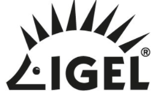
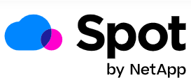

---
# required metadata
title: Windows 365 approved partners
titleSuffix:
description: Learn about the offerings that approved partners provide to Windows 365.
keywords:
author: ErikjeMS  
ms.author: erikje
manager: dougeby
ms.date: 04/20/2022
ms.topic: overview
ms.service: cloudpc
ms.subservice:
ms.localizationpriority: high
ms.technology:
ms.assetid: 

# optional metadata

#ROBOTS:
#audience:

ms.reviewer: chbrinkh
ms.suite: ems
search.appverid: MET150
#ms.tgt_pltfrm:
ms.custom: intune-azure; get-started
ms.collection: M365-identity-device-management
---

# Windows 365 approved partners

Windows 365 gives opportunities to independent software vendors. When building their Windows apps, these partners can reach a broader audience by delivering their apps in the cloud.

Here’s the list of approved partners that build and innovate with Windows 365.

## 10ZiG

Securely stream the Microsoft Windows 365 Cloud PC experience to high-performing 10ZiG endpoints that offer:

- Highly secure Windows 10 IoT LTSC 2021 and in-house Linux-based operating systems.
- A wide range of hardware with customization options available.
- Options to manage and deploy Cloud PCs by using Microsoft Endpoint Manager (MEM) and/or the 10ZiG Manager™ for increased safety, remote access, and ease of use.

For more information, visit the [10ZiG website](https://www.10zig.com/resources/vdi-blog/microsoft-windows-365-cloud).

## IGEL

Secure access to Windows 365 is further enhanced with IGEL OS:

- Optimized to connect to Cloud PC.
- Secure read-only OS removes security concerns at the edge.
- IGEL OS can be installed on any x86-64 device allowing even older devices to securely connect.

For more information, visit the [IGEL website](https://www.igel.com/windows365/).

## Nerdio

Windows 365 and Nerdio Manager help users to be productive from anywhere, on any device with a cloud-powered, secure, and always up-to-date Windows experience. Nerdio seamlessly lets MSPs and IT professionals:

- Instantly provision Cloud PCs.
- Manage physical and virtual devices through a unified portal.
- Realize a fixed and predictable price.

For more information, visit the [Nerdio website](https://getnerdio.com/windows-365/).

## NetApp

Spot by NetApp delivers fully managed, continuously optimized cloud desktops as a service.

For more information, read about Spot on the [NetApp website](https://spot.io/products/spotpc/).

## Rimo3

Rimo3 helps organizations understand the impact of adopting both traditional operational updates, like OS, app, and security patches, and new strategic technologies, like Windows 365 and Cloud PCs. With Rimo3, organizations can verify the readiness of their applications and unique operating environment for compatibility, functionality, and performance metrics, including MSIX suitability. Rimo3 supports businesses across the globe to adopt Windows 365 and deliver a best-in-class application experience.

With Rimo3, you can:

- Rapidly discover application suitability for onboarding to Windows 365 and provisioning Cloud PCs
- Test applications readiness against critical security and OS patch updates up to 10x faster than current processes
- Quickly assess resource and performance impacts for end-users before production implementation

## ServiceNow

ServiceNow and Microsoft are continuing to find new ways for employees to seamlessly collaborate while delivering great experiences to our joint customers.

For more information, read the blog on the [ServiceNOw website](https://blogs.servicenow.com/2021/microsoft-integration-optimizes-hybrid-work.html).

## UKG

Ultimate Kronos Group is an American multinational technology company that provides workforce management and human resource management services.

For more information, see [UKG's Newsroom](https://www.ukg.com/about-us/newsroom/ukg-expands-strategic-collaboration-microsoft).

<!-- ########################## -->
## Next steps

[Learn more about Windows 365](overview.md)
