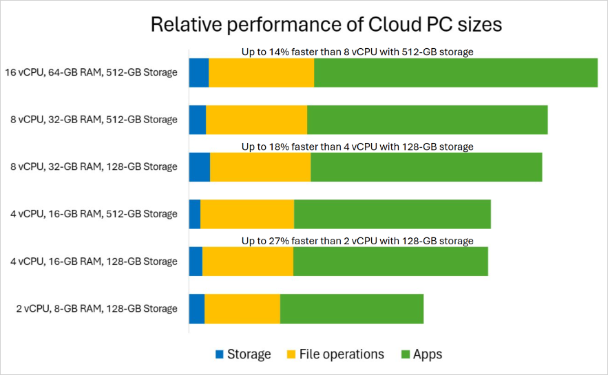

---
# required metadata
title: Relative performance for different Cloud PC sizes
titleSuffix:
description: Learn about performance of Cloud PCs in Windows 365.
keywords:
author: ErikjeMS  
ms.author: erikje
manager: dougeby
ms.date: 03/06/2023
ms.topic: overview
ms.service: windows-365
ms.subservice:
ms.localizationpriority: high
ms.technology:
ms.assetid: 

# optional metadata

#ROBOTS:
#audience:

ms.reviewer: 
ms.suite: ems
search.appverid: MET150
#ms.tgt_pltfrm:
ms.custom: intune-azure; get-started
ms.collection:
- M365-identity-device-management
- tier2
---

# Relative performance for different Cloud PC sizes

This article examines the relative performance between three common Cloud PC sizes. This information can help Windows 365 admins decide on the right Cloud PC size for their users.
For the purposes of the comparisons in this article, these commonly deployed sizes were used:

- 2 vCPU/8 GB RAM/128 GB storage
- 4 vCPU/16 GB RAM/128 GB storage
- 8 vCPU/32 GB RAM/128 GB storage

As Microsoft Cloud technology improves, the underlying virtual machines and platform that support Cloud PCs will also improve. Windows 365 development includes change management and update testing to make sure that Cloud PCs consistently support improvements in availability, performance, and the end user experience. This frees you from the need to track and adopt these changes yourselves. Instead, you can choose from a predefined set of Cloud PCs configurations for which the underlying platform is managed, tested, upgraded, and improved by Microsoft.

## Test methodology

For these comparisons, industry standard tests were run to measure:

- Storage performance.
- File operations, like opening/saving documents or viewing images.
- Apps, like video conferencing or browsers.

These tests were run with identical parameters through multiple iterations with reboots between each iteration. All Cloud PC configurations were in the same production environment in the same region. The tests approximate what a typical user would experience running common workloads such as Microsoft Edge and Microsoft 365 apps.

These tests didn’t factor in various customer-specific third-party agents often deployed in customer environments. Each of these will have its own resource requirements that can impact performance.

It can be valuable for you to do to your own testing with workloads approximating what your intended users require. Be sure to include the line-of-business applications that your employees run regularly. Use the results of your tests to determine the right choice for your users.

## Test results

A common starting point for Windows 365 Cloud PC users is the 2 vCPU / 8 GB RAM / 128 GB storage size. The chart shows that the relative performance improvement of the 4 vCPU configuration over the 2 vCPU configuration is up to 28% faster.  

For the workloads we test, the performance about the same when moving from 4 vCPU to 8 vCPU. However, more processor intensive workloads may see a greater improvement.

If you plan on running CPU-intensive workloads the differences are going to be more noticeable and favor a greater number of processors. For example, workloads like business analytics tools with large datasets in the 64-bit version of Microsoft Excel. For employees who are only using Microsoft Teams, browsers, or Microsoft 365 applications, the 4 vCPU configuration likely sufficient.

## Choosing the Cloud PC size for your users

If you’d like more help in choosing a Cloud PC size for your users, check out these resources:

- The [Find the right Windows 365 Cloud PC for your business](https://www.microsoft.com/en-us/windows-365/cloud-pc-chooser?) online questionnaire recommends Cloud PC sizes based on a few questions.
- The [Cloud PC size recommendations (Enterpise)](enterprise/cloud-pc-size-recommendations.md) and [Windows 365 Business sizing options](business/windows-365-business-sizing.md) articles suggest workloads for various sizes.
- The [Configure your Windows 365 Cloud PC form](https://www.microsoft.com/en-us/windows-365/enterprise/configure?sku=CFQ7TTC0HHS9%2F0012) lets you choose processor, RAM, and storage parameters. You’ll get real-time cost and supported workloads information based on your choices.

## What if I chose the wrong size for a user’s Cloud PC?

If it turns out that Cloud PC size that you chose isn’t meeting the user’s needs:

- For Windows 365 Enterprise, you can remotely change the size. You can change the vCPU cores, RAM, and storage. For more information, see [Resize a Cloud PC](resize-cloud-pc.md).
- For Windows 365 Business, you can purchase a different license of the needed size to replace the user's current license.

## Next steps

To learn more Cloud PC size options:

- For Windows 365 Enterprise, see [Cloud PC size recommendations](enterprise/cloud-pc-size-recommendations.md).
- For Windows 365 Business, see [Windows 365 Business sizing options](business/windows-365-business-sizing.md).
