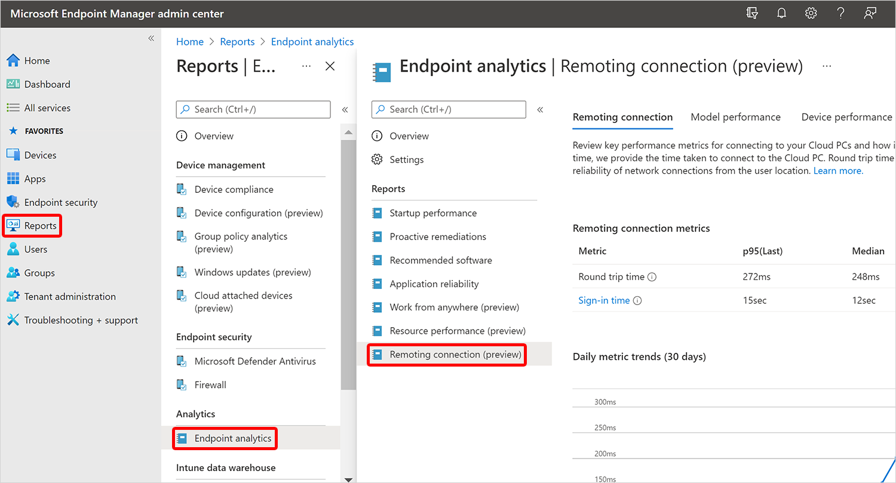

---
# required metadata
title: Remoting connection report for Windows 365
titleSuffix:
description: Learn about the Remoting connection report in Endpoint analytics for Windows 365 Cloud PCs.
keywords:
author: ErikjeMS  
ms.author: erikje
manager: dougeby
ms.date: 08/30/2021
ms.topic: overview
ms.service: cloudpc
ms.subservice:
ms.localizationpriority: high
ms.technology:
ms.assetid: 

# optional metadata

#ROBOTS:
#audience:

ms.reviewer: nandis
ms.suite: ems
search.appverid: MET150
#ms.tgt_pltfrm:
ms.custom: intune-azure;
ms.collection: M365-identity-device-management
---

# Remoting connection report

The Remoting connection report in [Endpoint analytics](/mem/analytics/overview) helps you monitor key performance metrics for connecting to the Cloud PCs. There are two metrics in this report:

- **Round trip time (ms)**
- **Sign in time (sec)**

Resource performance score also contributes to your organization's [Microsoft Productivity score](/microsoft-365/admin/productivity/productivity-score).

## Prerequisites

Before you can use this report, you'll need to [enroll your Cloud PC devices in Endpoint analytics](/mem/analytics/enroll-intune).

## Use the Remoting connection report

To get to the **Remoting connection** report, sign in to [Microsoft Endpoint Manager admin center](https://go.microsoft.com/fwlink/?linkid=2109431), select **Reports** > **Endpoint analytics** > **Remoting connection**.

## Remoting connection tab

The **Remoting connection** tab lists the following information: 

**Round Trip Time (ms)** is the speed and reliability of network connections from the user location. Times are given for the most recent time (p95 (Last)) and the Median time. The times for the ratings are:

- Good = 0-100 milliseconds
- Average = 100-200 milliseconds
- Poor = more than 200 milliseconds

**Sign in time (sec)** is the total time users take to connect to the Cloud PC. Times are given for the most recent sign in time (p95 (Last)) and the Median sign in time. The times for the ratings are:

- Good = 0-30 seconds
- Average = 30-60 seconds
- Poor = more than 60 seconds

**Insights and recommendations** suggests actions that you can take to improve your scores.

## Model performance tab

You can review the **Round trip time** and **Sign in time** for each Cloud PC model SKU in your organization.

## Device performance tab

You can review the **Round trip time** and **Sign in time** for each Cloud PC device in your organization.

## Device history

When you click on a particular device in one of the reports, you'll see specific information for that device.  

<!-- ########################## -->
## Next steps

[Resource performance report](report-resource-performance.md)
